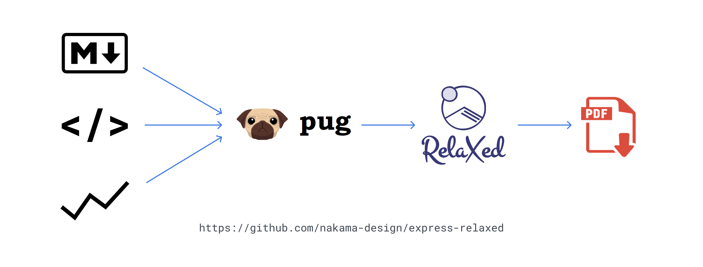

# Express Relaxed

This repository are project that implemented [ReLaXed](https://github.com/RelaxedJS/ReLaXed) on [Express](https://github.com/expressjs/express) server.

### Why?

**Nakama Design** handle project from small into medium size and sometime the application need to create PDF with custom data and design. So, we create this boilerplate that can we use for another project in the future.

Also, you can use this project personally or for you company too. Feel free to create issue if you have any problem. Or, you can contact us on mail at [we.are@nakama.design](mailto:we.are@nakama.design).

### Route

This boilerplate have 3 route with function like table below :

| Method | Route | Description |
| :---: | :--- | :--- |
| `GET` | / | Showing `browser.html` on example directory |
| `POST` | / | Main generator, any builded PDF will be move into `build` directory |
| `GET` | /preview/:name | Preview, will be show inline PDF file (buffer) with parameter name of the file |

### API

The route of `POST /` require parameter to generate a PDF with detail like this.

| Param | Description |
| :---: | :--- |
| `name` | The name of document |
| `theme` | Theme that will be use |
| `content` | A `Markdown` content to be generate |

### License

This project under MIT License
